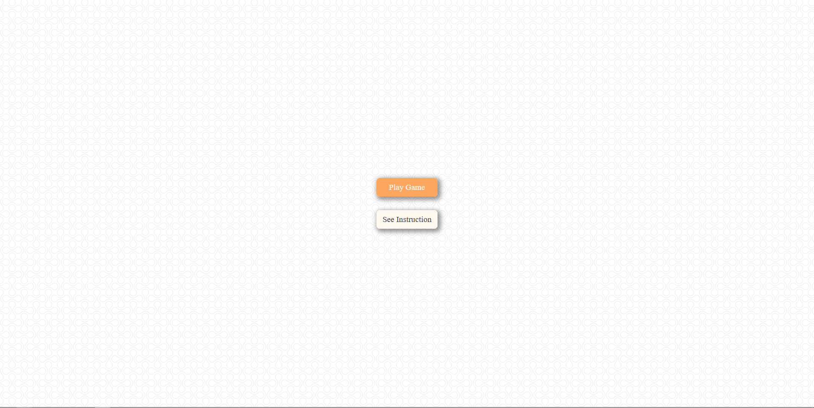
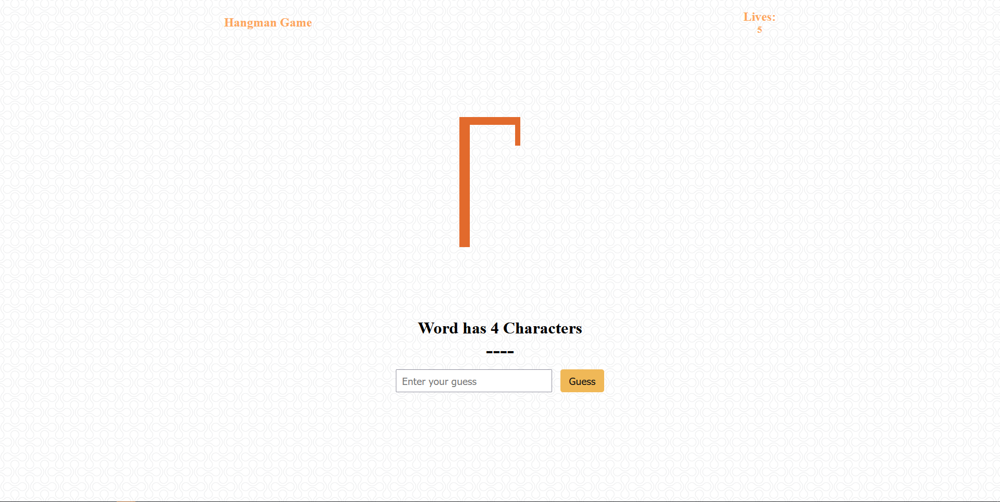
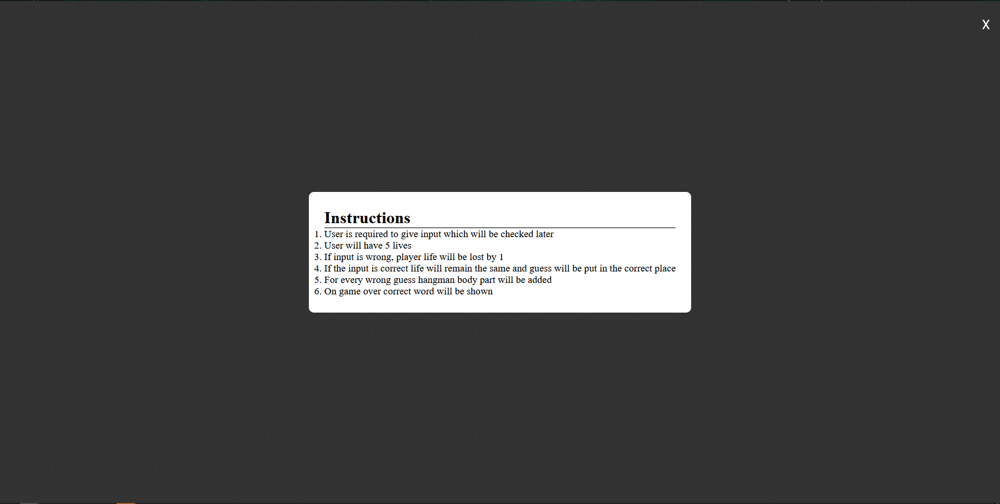
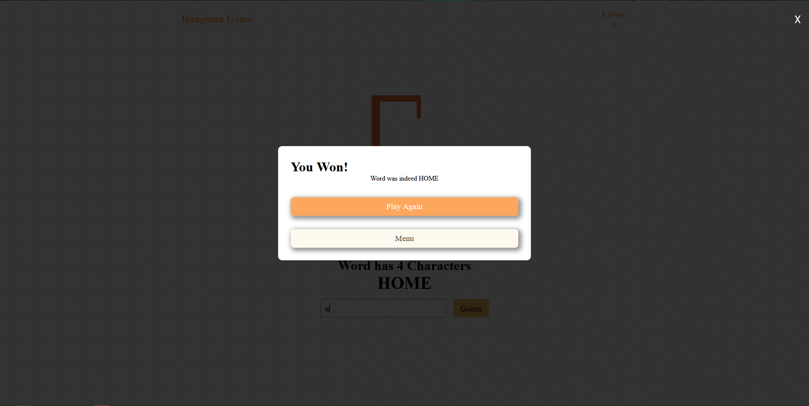
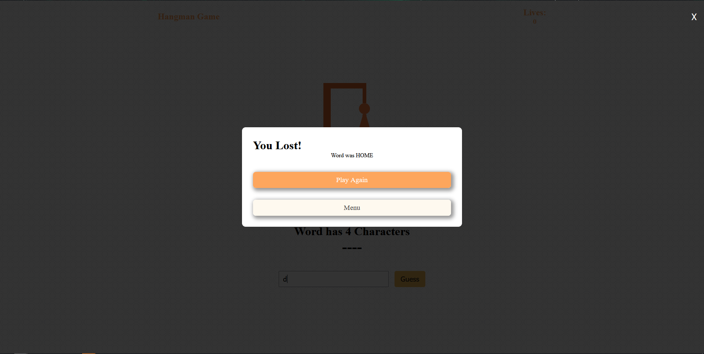

# Hangman Game

This is a part of 1 Project with multiple languages where I will try to make a project with the languages I know.
 
This is so that I dont get bored of one particular languages and to just revise the different languages
 
I have done this with Python and C++
 
Like the previous one the focus was to complete it in a day, not on clean code, but I tried to write clean code. Although wont be surprised if someone says "What a pathetic code :)"
 

## ScreenShots

### Start Screen

### Game Screen

### Instructions

### Win State

### Lost State

# Live Site

(https://hangman-game-mubashir.surge.sh/)

# Code

# Todos

<ul>
    <li>Attach a XML or text file to pick word randomly</li>
    <li>Clean this code in Future</li>
    <li>Make this same game in Vue and Angular</li>
</ul>

# Author

Mubashir Arif Randhawa

