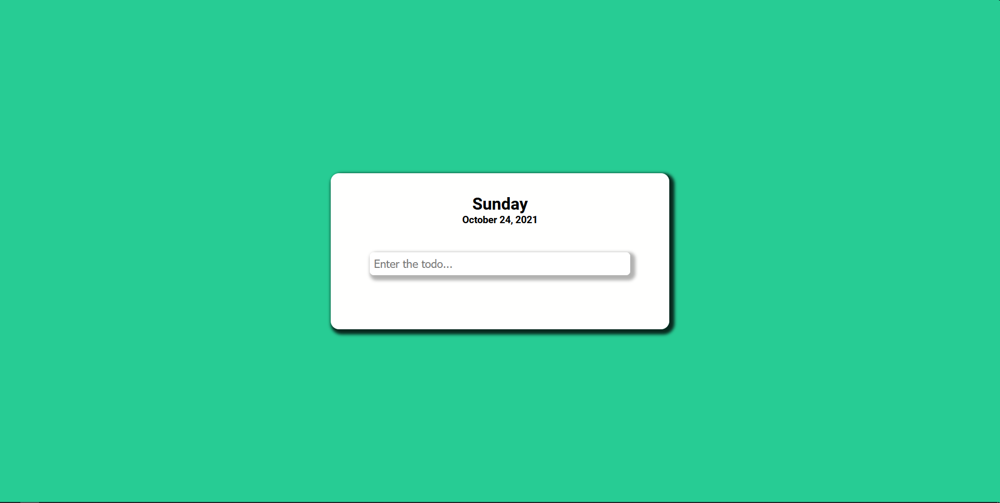
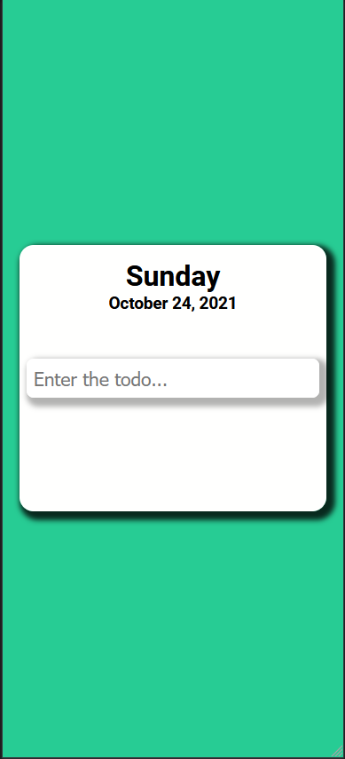

# Todo App

    This is the part of the project based learning I started to keep my Programming knowledege fresh that is "1 Project Multiple Languages" 

    This app is fully responsive and is made on Angular and took me about 5 hours or so to design this and make this into an app. 

    I tried to code it keeping in mind the objective of completing it in a day, So, code might not be that good

## Concepts Used

### CSS

<ul>
    <li>Flex Box</li>
    <li>Grid</li>
</ul>

### JS

<ul>
    <li>Local Storage</li>
    <li>Date Object</li>
    <li>Higher Order Functions</li>
    <li>Services</li>
    <li>Components</li>
    <li>Reusable Components</li>
</ul>

## Screenshots

## Live Site

(https://todo-app-angular.surge.sh//)

## Github

